# Lightweight TFTP Implementation for Embedded Linux

A lightweight **TFTP (Trivial File Transfer Protocol) server and client implemented in C for Embedded Linux systems**.

The project is being developed using a **responsibility-driven embedded software architecture**. The architecture separates protocol processing, UDP transport, file access, transfer state management, timers, error handling, and event dispatch into independently testable modules.

The implementation is designed to be:

* Modular
* Deterministic
* Testable
* Resource-conscious
* Suitable for Embedded Linux
* Easy to maintain and extend

---

## Table of Contents

* [Project Overview](#project-overview)
* [TFTP Protocol Scope](#tftp-protocol-scope)
* [Supported Operations](#supported-operations)
* [System Context](#system-context)
* [Architecture Principles](#architecture-principles)
* [Modular Architecture](#modular-architecture)
* [Level-1 Object Model](#level-1-object-model)
* [CRC Responsibilities](#crc-responsibilities)
* [Level-2 Decomposition](#level-2-decomposition)
* [Runtime Architecture](#runtime-architecture)
* [System Event Model](#system-event-model)
* [TFTP Transfer State Machines](#tftp-transfer-state-machines)
* [Use Cases](#use-cases)
* [Packet Architecture](#packet-architecture)
* [UDP Transport Architecture](#udp-transport-architecture)
* [File Access Architecture](#file-access-architecture)
* [Error Handling](#error-handling)
* [Resource and Memory Model](#resource-and-memory-model)
* [Project Structure](#project-structure)
* [Testing and TDD](#testing-and-tdd)
* [Integration Testing](#integration-testing)
* [Legacy Implementation](#legacy-implementation)
* [Migration Strategy](#migration-strategy)
* [Reliability](#reliability)
* [Security Considerations](#security-considerations)
* [Build and Development](#build-and-development)
* [Development Workflow](#development-workflow)
* [Roadmap](#roadmap)
* [Current Status](#current-status)
* [Architecture References](#architecture-references)
* [License](#license)

---

# Project Overview

This project implements a lightweight TFTP server and client for Embedded Linux.

The software is organized around **responsibilities and objects** rather than a traditional layered architecture.

The main responsibilities include:

* Application lifecycle management
* Event polling and dispatch
* TFTP server request handling
* TFTP client request handling
* TFTP transfer state management
* TFTP packet encoding and decoding
* UDP communication
* Local file access
* Timeout and retry management
* Error handling and reporting

The architecture is intended to support both:

1. **TFTP Server**
2. **TFTP Client**

while allowing the protocol and infrastructure components to be independently tested.

---

# TFTP Protocol Scope

The initial implementation follows the core behavior defined by **RFC 1350**.

The initial protocol scope includes:

* RRQ — Read Request
* WRQ — Write Request
* DATA — Data
* ACK — Acknowledgement
* ERROR — Error

Transport is provided using UDP.

The initial implementation intentionally focuses on the core TFTP protocol.

TFTP option extensions such as:

* RFC 2347 option negotiation
* RFC 2348 block size option
* RFC 2349 timeout/transfer-size options

are considered future extensions and are not part of the initial architecture baseline.

---

# Supported Operations

## RRQ — Read Request

A client requests a file from the TFTP server.

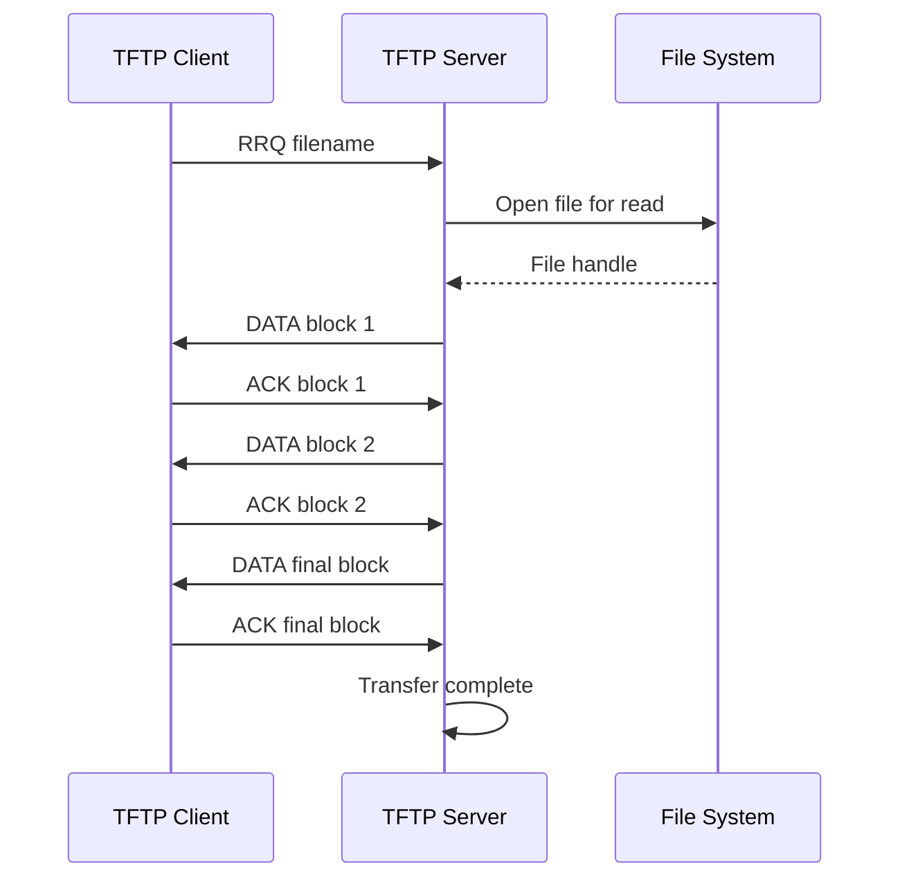

## WRQ — Write Request

A client sends a file to the TFTP server.

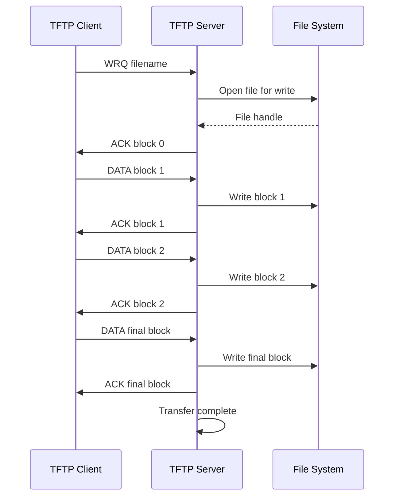

---

# System Context

The TFTP system operates between a remote TFTP peer and the Embedded Linux platform.

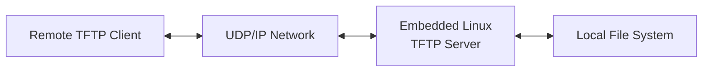

For client operation, the direction is reversed:

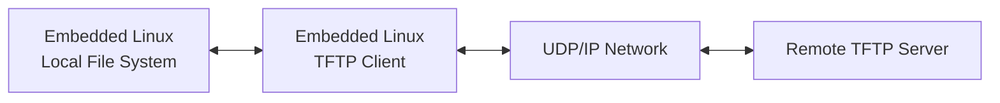

---

# Architecture Principles

The architecture follows a **responsibility-driven design approach**.

The primary principles are:

### 1. Responsibilities before implementation

The architecture first identifies:

* Objects
* Responsibilities
* Collaborations
* Events
* Runtime behavior

Implementation details are introduced after the architectural responsibilities are defined.

### 2. Single responsibility

Each module owns a clearly defined responsibility.

### 3. Encapsulation

Module state should remain private.

Public interfaces expose operations rather than internal implementation structures.

### 4. Deterministic resource usage

The initial design uses fixed-size resource pools rather than runtime allocation for transfer management.

### 5. Independent testability

Protocol logic, packet processing, transport, file access, and timer behavior should be testable independently.

### 6. Event-driven execution

The runtime architecture uses a single-threaded event-driven model.

### 7. Minimal coupling

Modules communicate through explicit interfaces rather than directly manipulating another module's internal state.

---

# Modular Architecture

The implementation is organized around clear responsibilities rather than traditional software layers.

Each module owns a specific responsibility and exposes a small interface to the rest of the system.

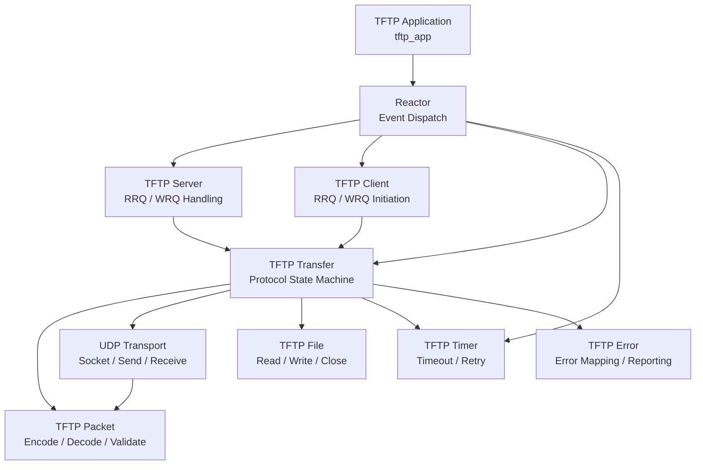

## Module Responsibility Summary

| Module          | Responsibility                                                     |
| --------------- | ------------------------------------------------------------------ |
| `tftp_app`      | Application initialization, startup, shutdown and lifetime control |
| `reactor`       | Event polling and event dispatch                                   |
| `tftp_server`   | Server request handling and transfer creation                      |
| `tftp_client`   | Client request initiation and client-side transfer handling        |
| `tftp_transfer` | TFTP transaction state machine                                     |
| `tftp_packet`   | Packet encoding, decoding and validation                           |
| `udp_transport` | UDP socket and network communication                               |
| `tftp_file`     | Local filesystem operations                                        |
| `tftp_timer`    | Timeout and retry management                                       |
| `tftp_error`    | Error classification and TFTP error mapping                        |

## Responsibility Flow

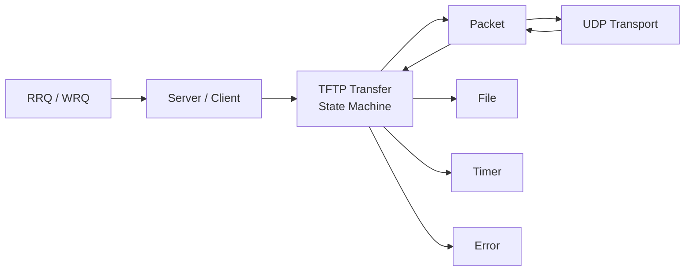

The central architectural boundary is:

```text
Server / Client
       |
       v
TFTP Transfer
       |
   +---+---+--------+--------+
   |       |        |        |
 Packet   UDP      File     Timer
                         \
                          Error
```

The **TFTP Transfer** module owns the protocol transaction state.

---

# Level-1 Object Model

The Level-1 object model identifies the major objects/responsibilities in the system.

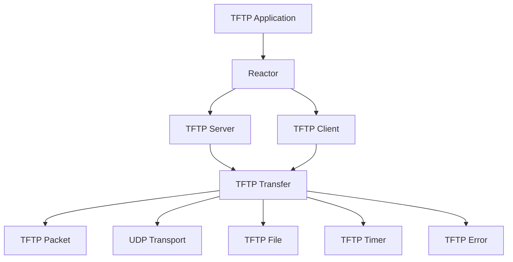

---

# CRC Responsibilities

CRC means:

**Class — Responsibilities — Collaborators**

The CRC analysis defines what each architectural object is responsible for and which other objects it collaborates with.

| Object               | Responsibilities                                                              | Collaborators                   |
| -------------------- | ----------------------------------------------------------------------------- | ------------------------------- |
| **TFTP Application** | Initialize system, configure modules, start runtime, shutdown                 | Reactor, Server, Client         |
| **Reactor**          | Poll events, detect network activity, dispatch callbacks/events               | Server, Client, Transfer, Timer |
| **TFTP Server**      | Receive RRQ/WRQ, validate requests, create transfers, associate peer endpoint | Transfer, Packet, UDP           |
| **TFTP Client**      | Initiate RRQ/WRQ, manage client transfer                                      | Transfer, Packet, UDP           |
| **TFTP Transfer**    | Own protocol state, block number, sequencing, retry, completion, cleanup      | Packet, UDP, File, Timer, Error |
| **TFTP Packet**      | Encode, decode and validate wire packets                                      | Transfer, UDP                   |
| **UDP Transport**    | Create/configure socket, receive/send packets, manage endpoints               | Reactor, Packet, Transfer       |
| **TFTP File**        | Open, read, write, close and report filesystem errors                         | Transfer                        |
| **TFTP Timer**       | Start, stop, expire timers and track retry deadlines                          | Reactor, Transfer               |
| **TFTP Error**       | Classify failures and map internal errors to TFTP ERROR responses             | Transfer, Packet                |

## CRC Collaboration

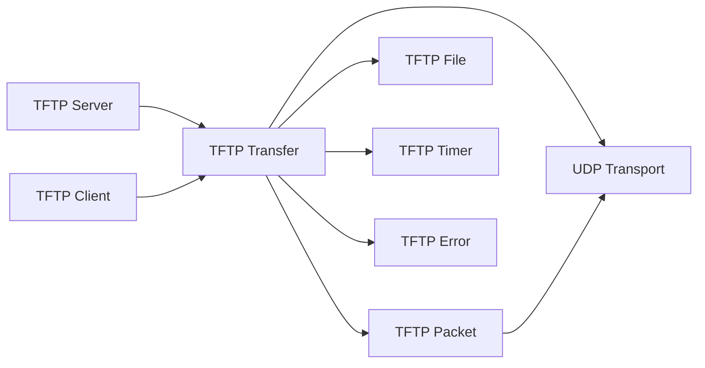

---

# Level-2 Decomposition

The Level-2 design decomposes each major responsibility into smaller implementation responsibilities.

```mermaid
flowchart TB

    TRANSFER["TFTP Transfer"]

    TRANSFER --> STATE["State Management"]
    TRANSFER --> BLOCK["Block Management"]
    TRANSFER --> SEQ["Sequence Validation"]
    TRANSFER --> RETRY["Retry Management"]
    TRANSFER --> ENDPOINT["Peer Endpoint / TID"]
    TRANSFER --> COMPLETE["Completion / Cleanup"]

    PACKET["TFTP Packet"]

    PACKET --> PARSER["Packet Parser"]
    PACKET --> ENCODER["Packet Encoder"]
    PACKET --> VALIDATOR["Packet Validator"]

    FILE["TFTP File"]

    FILE --> OPEN["Open"]
    FILE --> READ["Read"]
    FILE --> WRITE["Write"]
    FILE --> CLOSE["Close"]

    TIMER["TFTP Timer"]

    TIMER --> START["Start"]
    TIMER --> STOP["Stop"]
    TIMER --> EXPIRE["Expiration"]
    TIMER --> RETRY2["Retry Tracking"]

    SERVER["TFTP Server"]

    SERVER --> REQUEST["Request Handling"]
    SERVER --> POOL["Transfer Pool"]
    SERVER --> PEER["Peer Management"]

    UDP["UDP Transport"]

    UDP --> SOCKET["Socket Management"]
    UDP --> RX["Receive"]
    UDP --> TX["Transmit"]
    UDP --> ENDPOINT2["Endpoint Handling"]
```

---

# Runtime Architecture

The runtime model is a **single-threaded, event-driven Reactor architecture**.

The main execution loop waits for events and dispatches work to the appropriate responsibility.

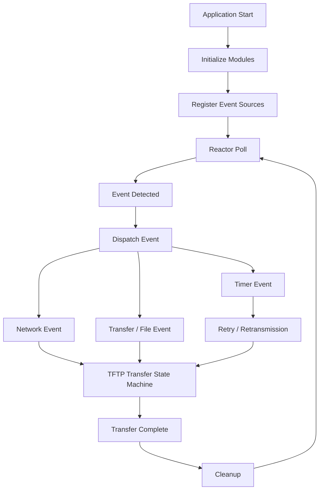

## Runtime Model

The runtime does not require a thread per transfer.

Instead:

```text
Main Loop
   |
   +--> poll()
   |
   +--> network event
   |       |
   |       +--> packet decode
   |       +--> transfer state update
   |
   +--> timer event
   |       |
   |       +--> retry
   |
   +--> transfer completion
           |
           +--> cleanup
```

This approach reduces concurrency complexity and provides deterministic resource usage.

---

# System Event Model

The system is driven by events.

| Event                    | Source   | Handler     | Result                             |
| ------------------------ | -------- | ----------- | ---------------------------------- |
| `EVT_RRQ`                | UDP      | Server      | Create read transfer               |
| `EVT_WRQ`                | UDP      | Server      | Create write transfer              |
| `EVT_DATA`               | UDP      | Transfer    | Validate/write/ACK                 |
| `EVT_ACK`                | UDP      | Transfer    | Advance transfer                   |
| `EVT_ERROR`              | UDP      | Transfer    | Abort transfer                     |
| `EVT_TIMEOUT`            | Timer    | Transfer    | Retransmit                         |
| `EVT_RETRY_EXHAUSTED`    | Timer    | Transfer    | Abort and cleanup                  |
| `EVT_FILE_READ_ERROR`    | File     | Transfer    | Generate error                     |
| `EVT_FILE_WRITE_ERROR`   | File     | Transfer    | Generate error                     |
| `EVT_INVALID_PACKET`     | Packet   | Transfer    | Reject packet                      |
| `EVT_DUPLICATE_DATA`     | UDP      | Transfer    | Re-ACK without duplicate write     |
| `EVT_DUPLICATE_ACK`      | UDP      | Transfer    | Ignore/recover according to state  |
| `EVT_WRONG_TID`          | UDP      | Transfer    | Reject without corrupting transfer |
| `EVT_TRANSFER_COMPLETE`  | Transfer | Application | Cleanup resources                  |
| `EVT_RESOURCE_EXHAUSTED` | Server   | Application | Reject new request                 |

---

# Event Flow

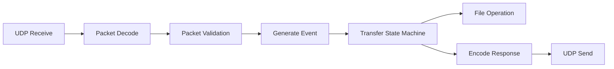

---

# TFTP Transfer State Machines

The transfer object owns the TFTP protocol transaction.

## RRQ State Machine

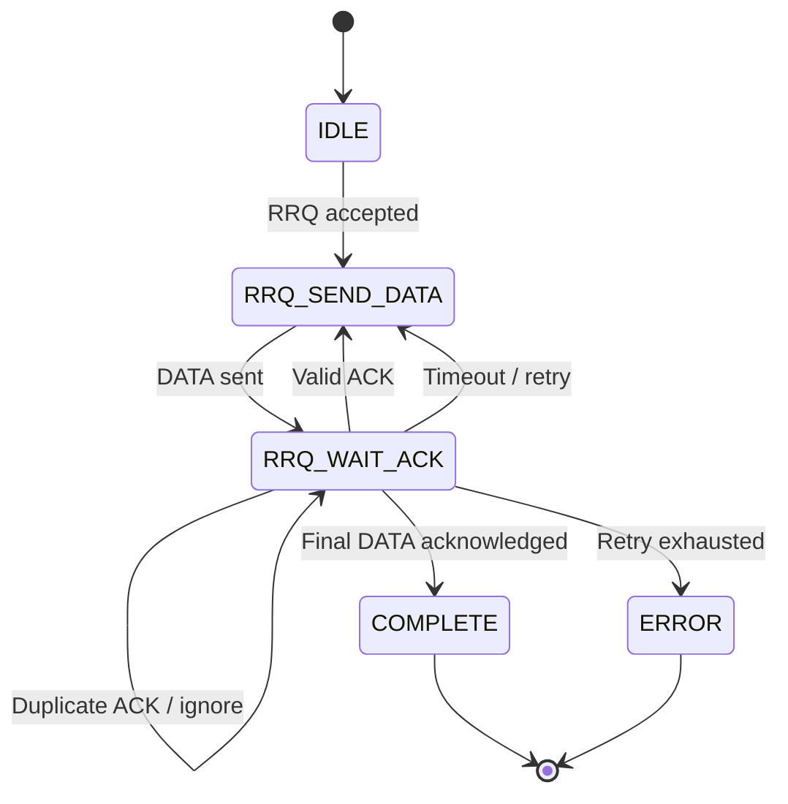

## WRQ State Machine

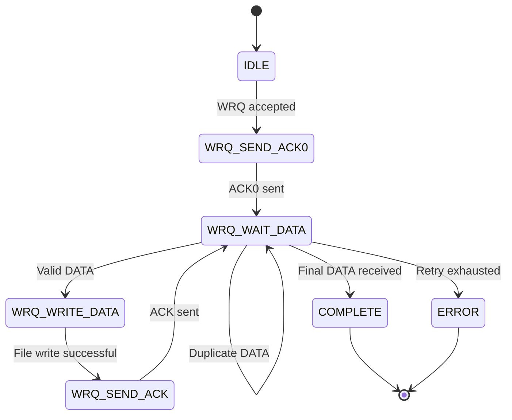

---

# TFTP Block Handling

TFTP transfers use block numbers.

For each transfer:

```text
DATA block 1
     |
    ACK 1
     |
DATA block 2
     |
    ACK 2
     |
DATA block 3
     |
    ACK 3
```

Only one DATA block is outstanding at a time in the initial implementation.

The transfer therefore retains the most recently transmitted packet so that it can be retransmitted after timeout.

---

# Final Block Handling

The classic TFTP data payload is up to **512 bytes**.

A DATA packet containing fewer than 512 bytes indicates the final data block.

Therefore:

```text
Payload < 512 bytes
        |
        v
Final DATA block
```

For a file whose size is an exact multiple of 512 bytes, an additional zero-length DATA packet is required to mark the end of the transfer.

Example:

```text
File size = 100 bytes

DATA 1 = 100 bytes
ACK 1
DONE
```

```text
File size = 512 bytes

DATA 1 = 512 bytes
ACK 1

DATA 2 = 0 bytes
ACK 2
DONE
```

```text
File size = 513 bytes

DATA 1 = 512 bytes
ACK 1

DATA 2 = 1 byte
ACK 2
DONE
```

---

# Duplicate and Invalid Packet Handling

The transfer module must protect the transaction from duplicate and invalid packets.

## Duplicate DATA

A duplicate DATA packet must not cause the file data to be written twice.

Expected behavior:

```text
DATA N
  |
  +--> expected block
  |       |
  |       +--> write
  |       +--> ACK N
  |
  +--> duplicate block
          |
          +--> do not write again
          +--> retransmit ACK N
```

## Duplicate ACK

A duplicate ACK must not advance the transfer state incorrectly.

## Wrong TID

A packet received from an unexpected transfer identifier must not corrupt the active transfer.

## Future Block

An unexpected future block should be rejected according to the protocol/error policy.

---

# Use Cases

## UC-01 — Successful RRQ

**Goal:** Download a file from the server.

```text
Client
  |
  +--> RRQ
  |
Server
  |
  +--> Open file
  |
  +--> DATA
  |
Client
  |
  +--> ACK
  |
  +--> repeat
  |
  +--> final ACK
  |
Complete
```

---

## UC-02 — Successful WRQ

**Goal:** Upload a file to the server.

```text
Client
  |
  +--> WRQ
  |
Server
  |
  +--> Open/create file
  |
  +--> ACK 0
  |
Client
  |
  +--> DATA
  |
Server
  |
  +--> Write
  +--> ACK
  |
Complete
```

---

## UC-03 — File Not Found

```text
RRQ
 |
Server
 |
 +--> File open fails
 |
 +--> ERROR
 |
Transfer terminated
```

---

## UC-04 — File Creation Failure

```text
WRQ
 |
Server
 |
 +--> File create/open fails
 |
 +--> ERROR
 |
Transfer terminated
```

---

## UC-05 — Packet Loss

```text
DATA N
  |
  X  packet lost

Timer expires
  |
Retransmit DATA N
  |
ACK N
```

---

## UC-06 — ACK Loss

```text
DATA N
  |
ACK N
  |
 X ACK lost

Timer expires
  |
Retransmit DATA N
  |
Duplicate DATA handling
  |
ACK N
```

---

## UC-07 — Duplicate DATA

The receiver must not write the same block twice.

---

## UC-08 — Wrong TID

Packets from an unexpected source/TID must not modify the active transfer.

---

## UC-09 — Retry Exhaustion

```text
Timeout
   |
Retry
   |
Timeout
   |
Retry
   |
...
   |
Maximum retries
   |
ERROR
   |
Cleanup
```

---

## UC-10 — Empty File

An empty file must be represented using the appropriate final zero-length DATA behavior.

---

## UC-11 — Exact 512-Byte File

A 512-byte file requires a subsequent zero-length DATA block to indicate completion.

---

## UC-12 — Resource Exhaustion

When all transfer contexts are occupied:

```text
New RRQ / WRQ
      |
      v
Transfer Pool Full
      |
      v
Reject Request
      |
      v
Report Resource Error
```

---

# Packet Architecture

The packet module owns wire-format handling.

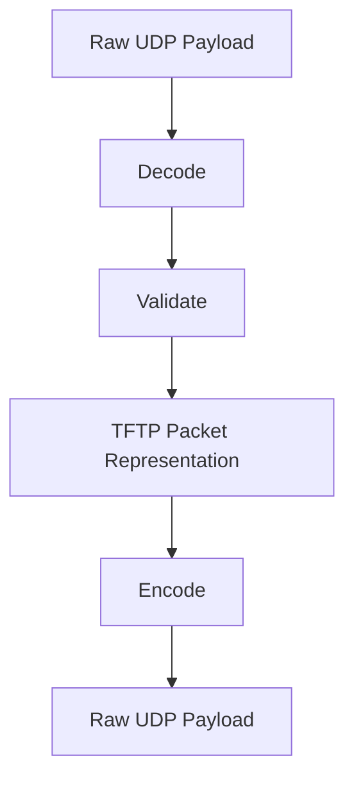

## Packet Types

```text
RRQ
WRQ
DATA
ACK
ERROR
```

## Packet Responsibilities

The packet module handles:

* Opcode extraction
* Field parsing
* Block number parsing
* Payload length validation
* Error code parsing
* Filename/mode parsing
* Packet encoding
* Packet validation

The packet module does not own transfer state.

---

# UDP Transport Architecture

The UDP transport module isolates Linux socket operations from protocol logic.

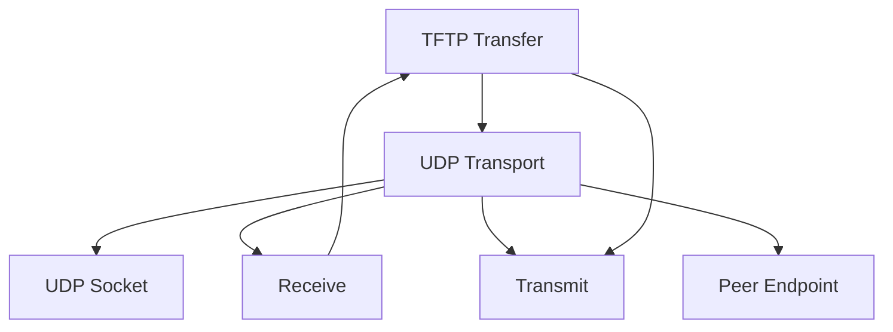

Responsibilities include:

* Socket creation
* Socket configuration
* Non-blocking operation
* Bind
* Receive
* Send
* Peer endpoint management
* Transfer endpoint/TID validation

Protocol parsing remains outside the transport module.

---

# File Access Architecture

The file module isolates filesystem operations.

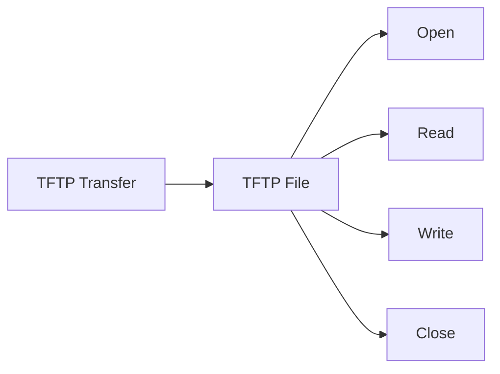

The transfer module decides **when** a file operation is required.

The file module decides **how** the local filesystem operation is performed.

---

# Error Handling

Errors are categorized into several groups.

## Protocol Errors

Examples:

* Invalid opcode
* Invalid packet length
* Invalid block number
* Invalid packet structure
* Unexpected packet type

## File Errors

Examples:

* File not found
* Permission denied
* File open failure
* Read failure
* Write failure
* Close failure

## Transport Errors

Examples:

* Socket failure
* Send failure
* Receive failure
* Invalid peer endpoint

## Resource Errors

Examples:

* Transfer pool exhausted
* File context exhausted
* Timer context exhausted

## Timeout Errors

Examples:

* DATA timeout
* ACK timeout
* Retry exhaustion

The error module maps internal failures into appropriate TFTP ERROR responses where applicable.

---

# Resource and Memory Model

The initial design favors deterministic resource usage.

Runtime transfer management should not depend on unrestricted dynamic allocation.

## Initial Resource Pools

| Resource              | Maximum |
| --------------------- | ------: |
| Transfer contexts     |       8 |
| File contexts         |       8 |
| Timer contexts        |       8 |
| UDP transport objects |       2 |

Maximum simultaneous transfers:

```text
8 transfers
```

A ninth simultaneous transfer request should be rejected or deferred according to the resource policy.

---

# Memory Strategy

The implementation favors:

* Static pools
* Fixed-size buffers
* Bounded packet sizes
* Explicit ownership
* Deterministic cleanup

Avoid unnecessary:

```c
malloc()
free()
```

in the transfer runtime.

Opaque module contexts are preferred so internal structures remain private.

---

# Project Structure

The active modular implementation is organized as follows:

```text
Embedded-Linux-Project/
│
├── README.md
├── .gitignore
│
├── src/
│   └── tftp/
│       │
│       ├── app/
│       │   ├── tftp_app.c
│       │   └── tftp_app.h
│       │
│       ├── reactor/
│       │   ├── reactor.c
│       │   └── reactor.h
│       │
│       ├── server/
│       │   ├── tftp_server.c
│       │   └── tftp_server.h
│       │
│       ├── client/
│       │   ├── tftp_client.c
│       │   └── tftp_client.h
│       │
│       ├── transfer/
│       │   ├── tftp_transfer.c
│       │   └── tftp_transfer.h
│       │
│       ├── packet/
│       │   ├── tftp_packet.c
│       │   └── tftp_packet.h
│       │
│       ├── transport/
│       │   ├── udp_transport.c
│       │   └── udp_transport.h
│       │
│       ├── file/
│       │   ├── tftp_file.c
│       │   └── tftp_file.h
│       │
│       ├── timer/
│       │   ├── tftp_timer.c
│       │   └── tftp_timer.h
│       │
│       └── error/
│           ├── tftp_error.c
│           └── tftp_error.h
│
├── tests/
│
├── legacy/
│   └── files/
│
└── build/
```

---

# Testing and TDD

Testing follows the responsibility-driven architecture.

Each module should be independently testable before full-system integration.

## Test Categories

### Packet Tests

* RRQ parsing
* WRQ parsing
* DATA parsing
* ACK parsing
* ERROR parsing
* Invalid opcode
* Invalid packet length
* Invalid fields
* Boundary payload lengths

### File Tests

* Open success
* File not found
* Permission failure
* Read success
* Read failure
* Write success
* Write failure
* Close

### Transfer Tests

* RRQ initialization
* WRQ initialization
* Block sequencing
* Duplicate DATA
* Duplicate ACK
* Wrong TID
* Future block
* Final block
* Retry
* Retry exhaustion
* Cleanup

### Timer Tests

* Start
* Stop
* Expiry
* Retry count
* Retry exhaustion

### Reactor Tests

* Event registration
* Event polling
* Event dispatch
* Multiple events
* Timeout handling

---

# TDD Matrix

| ID   | Test                            |
| ---- | ------------------------------- |
| T001 | Parse valid RRQ                 |
| T002 | Parse valid WRQ                 |
| T003 | Parse valid DATA                |
| T004 | Parse valid ACK                 |
| T005 | Parse valid ERROR               |
| T006 | Reject invalid opcode           |
| T007 | Reject malformed packet         |
| T008 | Validate DATA payload boundary  |
| T009 | Open existing file              |
| T010 | Handle missing file             |
| T011 | Handle file read failure        |
| T012 | Handle file write failure       |
| T013 | Start RRQ transfer              |
| T014 | Start WRQ transfer              |
| T015 | Generate DATA block             |
| T016 | Process valid ACK               |
| T017 | Process valid DATA              |
| T018 | Detect duplicate DATA           |
| T019 | Detect duplicate ACK            |
| T020 | Reject wrong TID                |
| T021 | Reject unexpected future block  |
| T022 | Detect final block              |
| T023 | Handle timeout                  |
| T024 | Retransmit packet               |
| T025 | Detect retry exhaustion         |
| T026 | Complete RRQ                    |
| T027 | Complete WRQ                    |
| T028 | Cleanup successful transfer     |
| T029 | Cleanup failed transfer         |
| T030 | Handle empty file               |
| T031 | Handle exact 512-byte file      |
| T032 | Handle 513-byte file            |
| T033 | Generate TFTP ERROR             |
| T034 | Handle transfer pool exhaustion |
| T035 | Reactor registration            |
| T036 | Reactor dispatch                |
| T037 | Non-blocking transport          |
| T038 | Multiple simultaneous transfers |
| T039 | Eight-transfer limit            |
| T040 | Reject ninth transfer           |

---

# Integration Testing

After module-level testing, integration tests should validate the complete runtime.

## Integration Test 1 — RRQ

```text
Client
  |
  +--> RRQ
  |
Server
  |
  +--> File
  |
  +--> DATA
  |
Client
  |
  +--> ACK
  |
Complete
```

## Integration Test 2 — WRQ

```text
Client
  |
  +--> WRQ
  |
Server
  |
  +--> ACK 0
  |
Client
  |
  +--> DATA
  |
Server
  |
  +--> File write
  +--> ACK
  |
Complete
```

## Integration Test 3 — Packet Loss

Verify retransmission after simulated packet loss.

## Integration Test 4 — Multiple Transfers

Verify multiple transfers can progress through the same event-driven runtime.

## Integration Test 5 — Resource Exhaustion

Start the maximum supported number of transfers and verify that additional requests are handled correctly.

---

# Legacy Implementation

The repository may contain an older TFTP implementation preserved under:

```text
legacy/
```

The legacy implementation is retained for:

* Reference
* Comparison
* Migration
* Regression understanding

It is **not the architectural baseline for the new implementation**.

The new implementation is based on the modular responsibility-driven design under:

```text
src/tftp/
```

---

# Migration Strategy

Migration from the legacy implementation should occur incrementally.

Recommended migration order:

```text
Legacy Packet Logic
       |
       v
TFTP Packet Module
       |
       v
UDP Transport
       |
       v
File Module
       |
       v
Transfer State Machine
       |
       v
Server / Client
       |
       v
Reactor
       |
       v
Application
```

The recommended first functional vertical slice is:

```text
UDP
 |
 v
Reactor
 |
 v
RRQ
 |
 v
Transfer
 |
 v
File
 |
 v
DATA
 |
 v
ACK
```

This creates an end-to-end RRQ path before adding the complete feature set.

---

# Reliability

The design includes basic reliability mechanisms appropriate for an embedded network service.

## Timeout and Retry

Lost packets are handled through bounded retransmission.

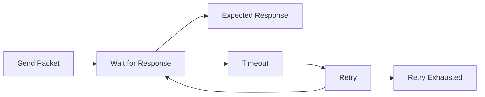

## Cleanup

Every transfer must eventually reach one of:

```text
SUCCESS
ERROR
ABORT
```

and release:

* Transfer context
* File context
* Timer context
* UDP resources associated with the transfer

## Watchdog

Where the target system requires watchdog supervision, the watchdog should be refreshed from the main execution context or scheduler rather than from an ISR.

---

# Security Considerations

TFTP itself does not provide:

* Encryption
* Authentication
* Confidentiality
* Integrity protection beyond protocol-level behavior

Therefore the deployment environment should be trusted or otherwise protected.

The implementation should also:

* Validate filenames
* Prevent path traversal
* Restrict the filesystem directory exposed through TFTP
* Validate packet lengths
* Validate packet types
* Validate peer endpoints/TIDs
* Bound retries
* Reject resource-exhaustion conditions safely

Example unsafe path:

```text
../../etc/passwd
```

The file-access policy should prevent traversal outside the configured TFTP root directory.

---

# Build and Development

The project is written in C for Embedded Linux.

The implementation should be buildable using a standard Linux C toolchain.

Typical development environment:

```text
Linux
GCC / Clang
POSIX sockets
UDP/IP
```

The exact compiler flags, build system, and target toolchain should be documented once the project build configuration is finalized.

---

# Development Workflow

Development follows the architecture workflow:

```text
Stage 1
Problem Definition + Context Diagram
        |
        v
Stage 2
Level-1 Object Model
        |
        v
Stage 3
CRC + Level-2 Decomposition
        |
        v
Stage 4
System Event Model
        |
        v
Stage 5
Runtime Architecture
        |
        v
Stage 6
Module Catalog + Project Structure
        |
        v
Stage 7
TDD Specification
        |
        v
Stage 8
Module Interfaces
        |
        v
Stage 9
Module Implementation
        |
        v
Stage 10
Architecture + Code Review
```

Each stage should produce a defined architectural artifact before progressing to the next stage.

---

# Architecture Traceability

The implementation should maintain traceability from requirements to architecture and tests.

```text
Use Case
   |
   v
System Event
   |
   v
CRC Responsibility
   |
   v
Module
   |
   v
Interface
   |
   v
Implementation
   |
   v
TDD Test
```

Example:

```text
UC-01 Successful RRQ
        |
        v
EVT_RRQ
        |
        v
TFTP Server
        |
        v
TFTP Transfer
        |
        v
tftp_transfer_start_rrq()
        |
        v
RRQ transfer tests
```

---

# Roadmap

## Phase 1 — Architecture

* [x] Problem definition
* [x] Context diagram
* [x] Level-1 object model
* [x] CRC responsibilities
* [x] Level-2 decomposition
* [x] Event model
* [x] Runtime architecture
* [x] Module structure
* [x] TDD specification
* [x] Module interface planning

## Phase 2 — Core Implementation

* [ ] Packet encoder
* [ ] Packet decoder
* [ ] Packet validation
* [ ] UDP transport
* [ ] File abstraction
* [ ] Timer implementation
* [ ] Error module
* [ ] Transfer state machine
* [ ] Static resource pools
* [ ] Reactor

## Phase 3 — TFTP Server

* [ ] RRQ
* [ ] WRQ
* [ ] DATA
* [ ] ACK
* [ ] ERROR
* [ ] Multiple transfers
* [ ] Resource exhaustion handling

## Phase 4 — TFTP Client

* [ ] RRQ client
* [ ] WRQ client
* [ ] Retry handling
* [ ] Error handling
* [ ] Completion handling

## Phase 5 — Testing

* [ ] Unit tests
* [ ] Mock transport tests
* [ ] File tests
* [ ] Timer tests
* [ ] Transfer tests
* [ ] Integration tests
* [ ] Packet-loss tests
* [ ] Multiple-transfer tests

## Phase 6 — Review

* [ ] Architecture review
* [ ] API review
* [ ] C coding-standard review
* [ ] Resource review
* [ ] Error-path review
* [ ] Security review
* [ ] Runtime behavior review

---

# Current Status

The project has established the architecture for the modular TFTP implementation.

The current architectural baseline includes:

* Responsibility-driven object model
* CRC responsibilities
* Level-2 decomposition
* Event model
* Single-threaded Reactor runtime
* Modular project structure
* TFTP transfer state machines
* TDD specification
* Static resource model
* Legacy implementation separation

The implementation is being developed incrementally from the architecture.

The README intentionally does not claim the complete production implementation is finished until the corresponding modules and tests have been implemented and verified.

---

# Architecture References

The project architecture is based on responsibility-driven embedded software design principles and the engineering design material used during the architecture process.

Relevant topics include:

* Embedded software architecture
* Responsibility-driven design
* CRC analysis
* Event-driven runtime architecture
* Embedded C design patterns
* Embedded testing and TDD
* Embedded data structures and algorithms
* Modular C interfaces
* Deterministic resource management

Protocol reference:

**RFC 1350 — The TFTP Protocol (Revision 2)**

---

# License

```markdown
# License

This project is licensed under the MIT License.

See the [LICENSE](LICENSE) file for the complete license text.

# Author

**Anirudh Reddy**

Embedded Linux / Embedded C TFTP Project

Repository:

```text
Embedded-Linux-Project
```

---

## Architecture Summary

The final architecture can be summarized as:

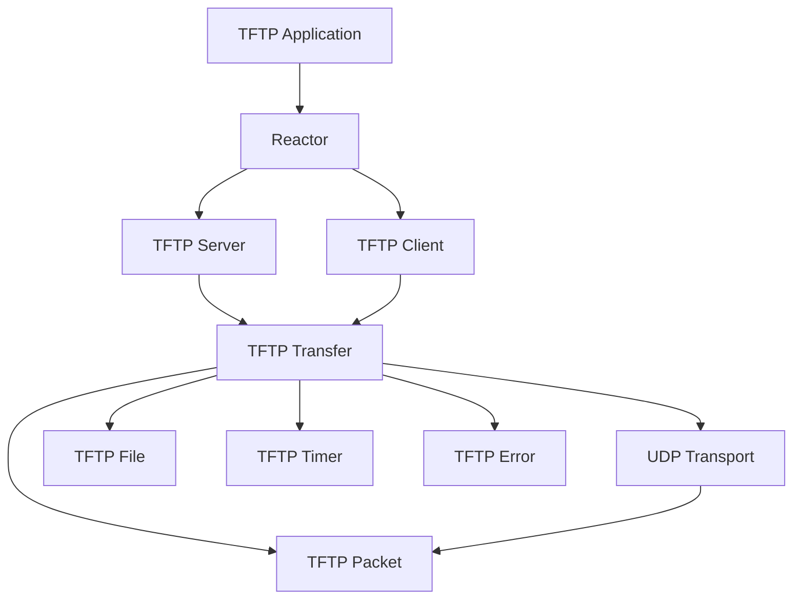

The core architectural principle is:

> **The TFTP Transfer owns the protocol transaction, while Packet, UDP, File, Timer, and Error modules provide focused services.**

This keeps the firmware modular, deterministic, testable, and maintainable for Embedded Linux.
